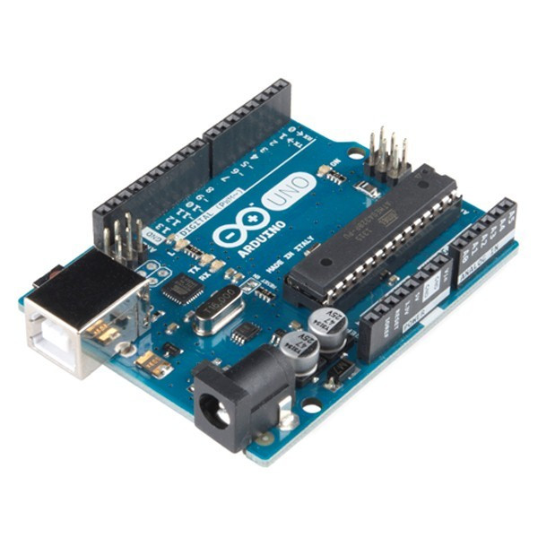
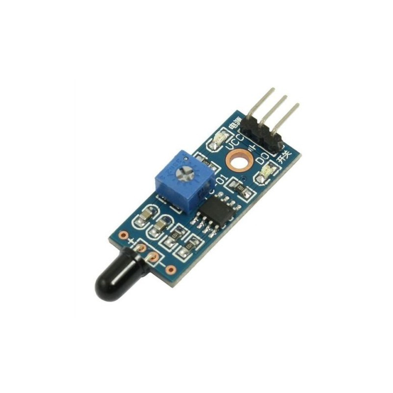
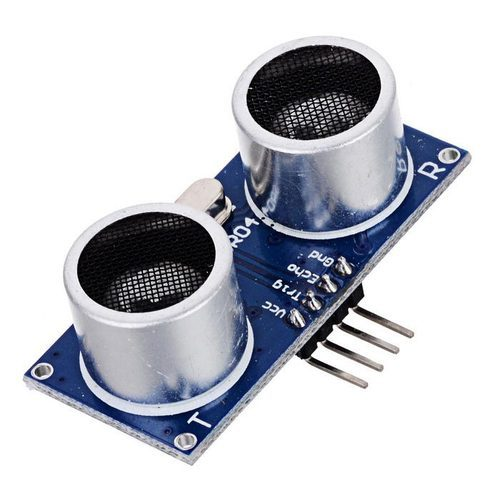
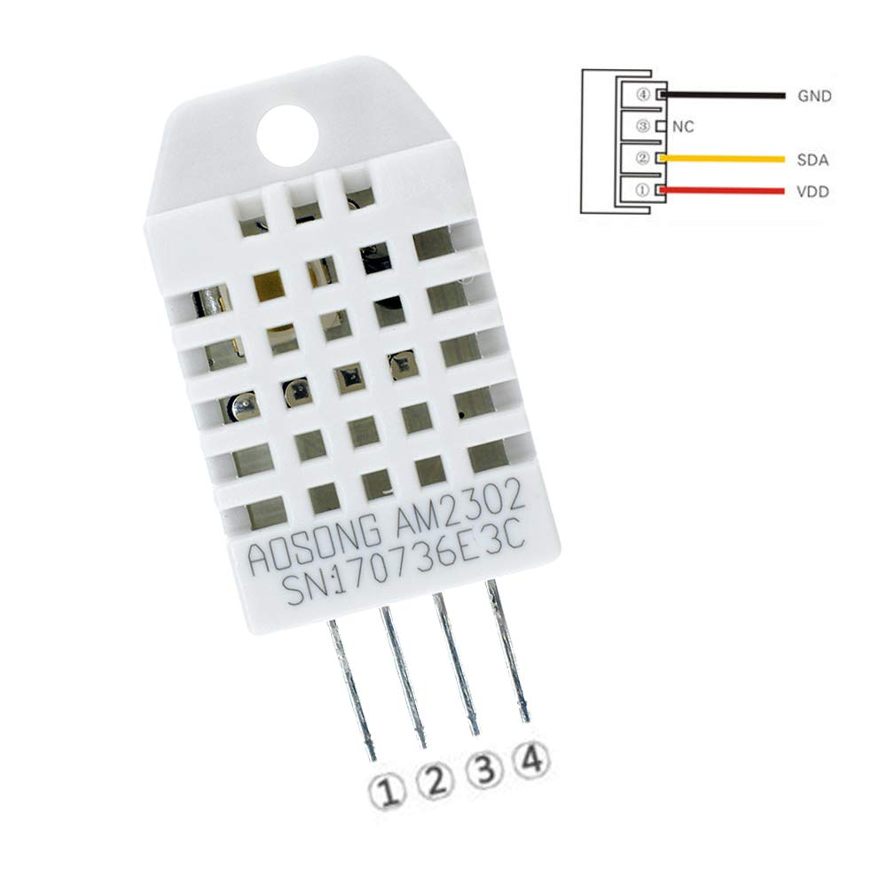
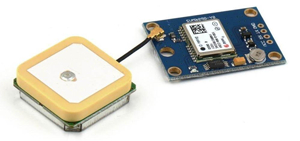
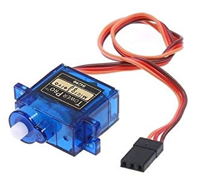
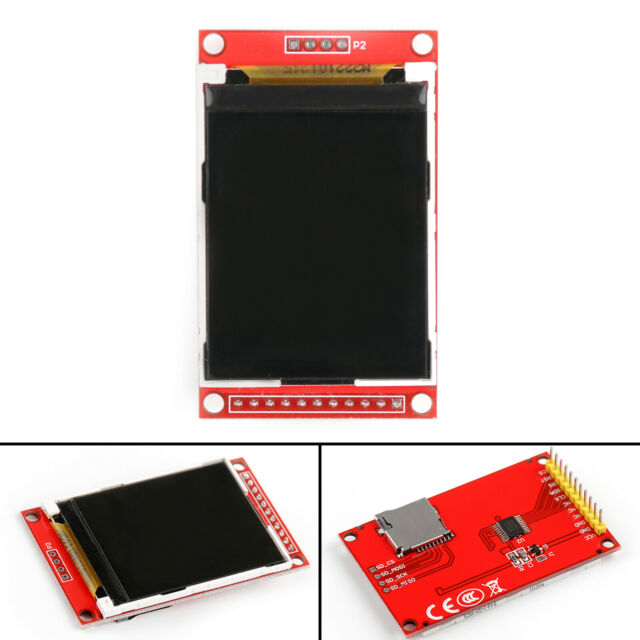

# Smart_Ship
This is an IoT based project that we have done for our agile module. It contains codes for many sensors that might be used in a theoritical smart ship.

# RFID_Doorlock
This is a system that is used to protect from unauthorized users. It uses RFID technology that only accepts the RFID's that have been registered in the database and opens the door. This way the product can be secured.

# Fire_Detection
This is a system that is used to detect fire if there is one on the ship. It uses a smoke sensor that detects smoke and then informs the uses through notification, for that we have used NodeMCU.

# Lighthouse
This is a system that turns the light on when the user tells it to turn on using his/her mobile device. It is a wireless system that can be operated through WiFi technology, for that we have used NodeMCU.

# People_Counter
This is a system that detects the number of people that have entered the premesis and how many have exited. It uses an ultrasonic sensor that detects object and sends that information to the user. We can then calculate how many people have entered, exited and are still on the ship.

# Radar on Laptop
This is a sytem that helps in preventing the ship from crashing. It detects obstacles on a 180 angle and notifies the user by changing the colour of the radar lines. It uses ultrasonic sensor and servo motor that detects the obstacles and rotates the seensor through 180 degrees. It uses a processing app that processes the values that the sensor sends through the serial port of the arduino and shows it on a laptop. 

# Radar on TFT LCD ILI9225
This is same kind of radar system as stated above. The difference is that instead of showing the radar on a laptop it uses a LCD screen to show the radar.

# GPS
This is a gps technology that shows the current location of the ship. It uses a GPS sensor that deetects the location of the ship and sends it using NodeMCU through WiFi which can then be seen on a mobile device.

# Weather Station
This is a simple weather detection system that shows the current temperature and humidity using a AM2302 sensor. It then displays this information on a TFT LCD screen.

# YOUTUBE link
https://youtu.be/mFpvrt69edg

# Senors and other devices that we have used 

# NodeMCU

# Arduino UNO

# Flame-Sensor

# Raindrop Sensor

# Ultrasonic Sensor

# AM2302 Sensor

# GPS

# Servo

# TFT LCD ILI9225

